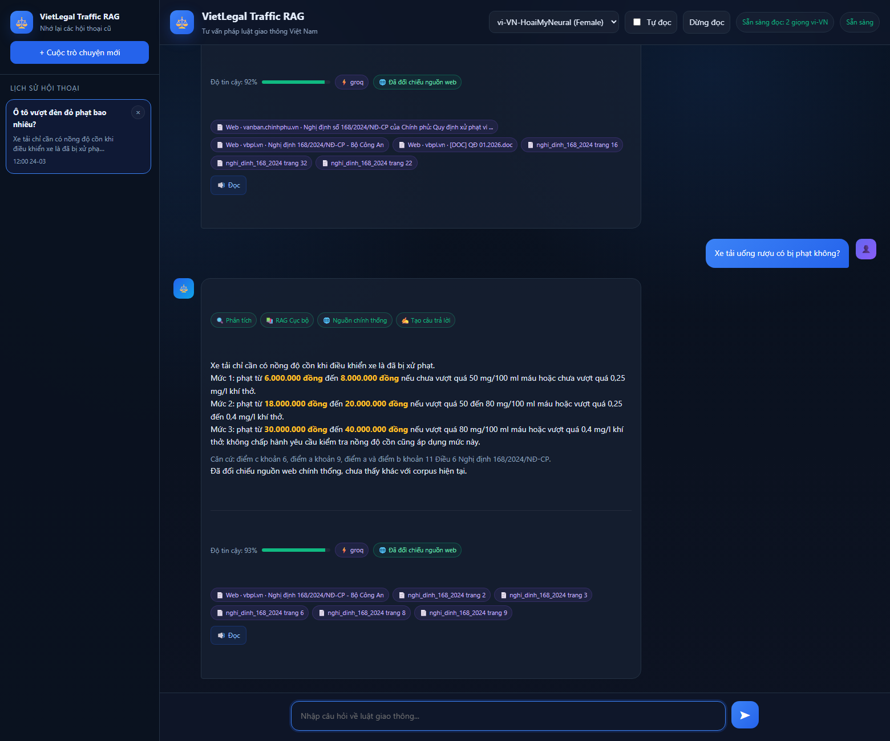
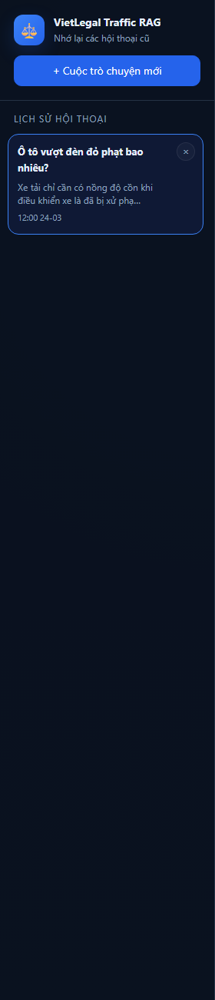
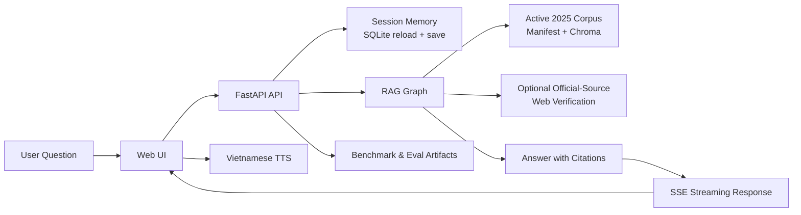

# VietLegal Traffic RAG


Scoped Vietnamese traffic-law RAG for the `LLM product / RAG engineer` lane. The app answers a narrow set of traffic-law questions, keeps short-term session memory, and can verify official sources when the user asks for a web-confirmed answer.

## Overview

- narrow scope instead of broad legal-AI claims
- active 2025 corpus managed through `data/manifest.json`
- reproducible benchmark artifacts and a public eval package
- local web demo with SSE streaming, session history, and Vietnamese TTS
- Docker + Render-ready deployment files for portfolio demos
- Hugging Face Spaces path for a free public demo

## Evidence





### Benchmark Highlights

Local benchmark run on `2026-03-27` using the repo-local eval package at [`datasets/vietlegal-traffic-eval-v2/README.md`](datasets/vietlegal-traffic-eval-v2/README.md):

| Mode | Cases | Pass Rate | Errors | Citation Rate | Avg Confidence |
| --- | ---: | ---: | ---: | ---: | ---: |
| `full` | 300 | 98.3% | 0 | 100.0% | 0.823 |

- Full artifacts: [`docs/benchmarks/latest_summary.md`](docs/benchmarks/latest_summary.md) and [`docs/benchmarks/latest_results.json`](docs/benchmarks/latest_results.json)
- Dataset package: [`datasets/vietlegal-traffic-eval-v2/README.md`](datasets/vietlegal-traffic-eval-v2/README.md)
- Dataset publish notes: [`datasets/vietlegal-traffic-eval-v2/README.md`](datasets/vietlegal-traffic-eval-v2/README.md)
- Demo flow: [`docs/demo-script.md`](docs/demo-script.md)

## Architecture



This is the real demo pipeline in one view: the browser sends a question to FastAPI, the app reloads short-term memory, retrieves from the active traffic-law corpus, optionally verifies official sources, then streams back an answer with citations and optional Vietnamese TTS.

- Longer walkthrough: [`docs/architecture.md`](docs/architecture.md)
- Scope statement: this is a traffic-law RAG demo, not a general legal chatbot platform

## Why This Is Trustworthy

- Scoped domain instead of "answer everything" behavior
- Explicit refusal for out-of-scope topics such as GPLX procedures or vehicle registration
- Active 2025 corpus policy managed via [`data/manifest.json`](data/manifest.json)
- Optional official-source web verification when the user explicitly asks for source confirmation
- Session memory for follow-up turns and sidebar-visible history recovery
- Benchmarkable pipeline with mode flags for `reranker` and `web fallback`

## Quick Start

Clone the public repo:

```powershell
git clone https://github.com/lyhoangai/vietlegal-traffic-rag.git
cd vietlegal-traffic-rag
```

Install dependencies:

```powershell
.\.venv\Scripts\python.exe -m pip install -r requirements.txt
```

Create `.env` from `.env.example` and set at least:

- `GROQ_API_KEY`
- `LLM_PROVIDER=groq`
- `EMBEDDING_PROVIDER=local`
- `MEMORY_DB_PATH=./chat_memory.db`

Optional but recommended for stronger web fallback:

- `SERPER_API_KEY`
- `TAVILY_API_KEY`

Build the vector database:

```powershell
.\.venv\Scripts\python.exe -m src.ingest.build_db
```

Run the app:

```powershell
.\.venv\Scripts\python.exe -m uvicorn src.api.main:app --host 127.0.0.1 --port 8000
```

Open the web UI:

```text
http://127.0.0.1:8000/
```

## Run with Docker

Build and run the app in a container:

```powershell
docker compose up --build
```

The container uses [`src/deploy/bootstrap.py`](src/deploy/bootstrap.py) as its startup command. On the first boot it builds Chroma into `/app/storage/chroma_db`, then starts `uvicorn`. Later restarts reuse that storage instead of rebuilding from scratch.

What persists in Docker:

- Chroma collections via the named volume `vietlegal_storage`
- chat session memory via `/app/storage/chat_memory.db`

What you still need locally:

- a filled `.env` with at least `GROQ_API_KEY`
- the 2025 traffic-law PDFs listed in [`data/manifest.json`](data/manifest.json)

## Deploy on Render

This repo now includes a Render Blueprint at [`render.yaml`](render.yaml).

Recommended flow:

1. Push the repo to GitHub.
2. In Render, create a new Blueprint from the repo.
3. Keep the bundled Docker runtime and attach the persistent disk defined in `render.yaml`.
4. Set secret env vars like `GROQ_API_KEY`, plus `SERPER_API_KEY` / `TAVILY_API_KEY` if you want stronger official-source fallback.
5. Deploy and wait for the first boot to finish building Chroma before testing `/chat`.

Render notes:

- the service uses `Docker` instead of a native Python runtime for reproducible builds
- the persistent disk is mounted at `/app/storage`, which keeps Chroma and chat-memory files across restarts
- the health check uses `GET /health`
- first deploy will be slower because the app may download the local embedding model and build the vector store

## Free Deploy on Hugging Face Spaces

If you want a free public demo instead of a paid Render service with persistent disk, use Hugging Face Spaces with the Docker SDK.

- Space README template: [`README.hf-space.md`](README.hf-space.md)
- Step-by-step guide: [`docs/deploy-huggingface-spaces.md`](docs/deploy-huggingface-spaces.md)

Trade-offs:

- free Spaces can sleep after inactivity
- storage is not persistent on the free tier, so chat memory and rebuilt Chroma state can reset
- for a portfolio demo, this is usually acceptable

## API / Endpoints

- `POST /chat`
- `POST /chat/stream`
- `GET /chat/history?session_id=...`
- `GET /chat/sessions`
- `DELETE /chat/sessions/{session_id}`
- `GET /tts/voices?locale=vi-VN`
- `POST /tts`
- `GET /health`
- `GET /eval/metrics`

## Tests

Run the full suite:

```powershell
.\.venv\Scripts\python.exe -m pytest tests -q
```

Run the smoke benchmark used by CI:

```powershell
.\.venv\Scripts\python.exe -m src.eval.run_benchmark --smoke
```

Regression coverage includes routing, follow-up memory, official-source fallback, benchmark artifacts, manifest-driven ingestion, chat history endpoints, SSE streaming, and TTS endpoints.

## Known Limits

- not production-ready
- memory is intentionally short-term only
- retrieval quality still depends on chunking and corpus coverage
- the public benchmark is compact and portfolio-focused
