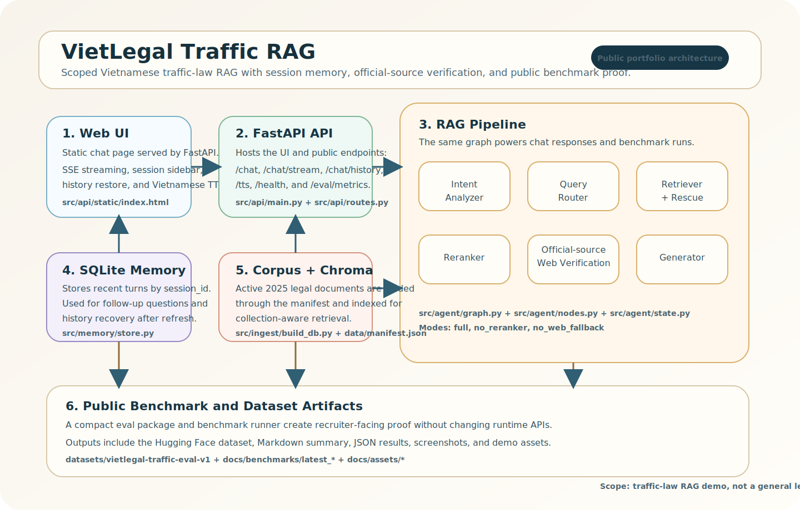

# VietLegal Traffic RAG Architecture

## Goal

Build a local demo that answers Vietnamese traffic-law questions credibly within a narrow scope:

- penalties
- core traffic rules
- expressway speed questions

The architecture favors explainability, conservative fallback behavior, short-term memory, and recruiter-friendly proof.

## Request Flow

1. The user sends a question to `/chat` or `/chat/stream`.
2. The API reloads recent turns from SQLite using `session_id`.
3. The graph runs `intent_analyzer`, `query_router`, `retriever`, `reranker`, `web_searcher`, and `generator`.
4. The app stores the assistant turn and exposes it again through history endpoints.
5. Benchmarks exercise the same pipeline in different modes.

## Main Layers

### Web UI

- [`../src/api/static/index.html`](../src/api/static/index.html)
- Streams answers over SSE
- Restores prior sessions and chat history
- Plays Vietnamese TTS for local demos

### FastAPI API

- [`../src/api/main.py`](../src/api/main.py)
- [`../src/api/routes.py`](../src/api/routes.py)
- Serves the web app and chat endpoints
- Translates graph output into API payloads

### RAG Pipeline

- [`../src/agent/graph.py`](../src/agent/graph.py)
- [`../src/agent/nodes.py`](../src/agent/nodes.py)
- [`../src/agent/state.py`](../src/agent/state.py)
- Handles intent analysis, routing, retrieval, reranking, web fallback, and answer generation

### Session Memory

- [`../src/memory/store.py`](../src/memory/store.py)
- Uses SQLite for short-term follow-up context
- Keeps the demo simple and easy to explain in interviews

### Corpus and Retrieval

- [`../src/ingest/loader.py`](../src/ingest/loader.py)
- [`../src/ingest/build_db.py`](../src/ingest/build_db.py)
- [`../data/manifest.json`](../data/manifest.json)
- Loads only the active 2025 corpus and rebuilds Chroma from the manifest

### Benchmark and Public Dataset

- [`../src/eval/run_benchmark.py`](../src/eval/run_benchmark.py)
- [`../datasets/vietlegal-traffic-eval-v1/README.md`](../datasets/vietlegal-traffic-eval-v1/README.md)
- [`../docs/benchmarks/latest_summary.md`](../docs/benchmarks/latest_summary.md)
- Produces recruiter-facing proof without changing runtime APIs

## Design Choices

- Narrow legal scope instead of broad but unreliable coverage
- Short-term session memory instead of complex user-profile memory
- Official-source web confirmation only when local evidence is weak or the user asks for it
- Manifest-driven active corpus selection so the legal basis stays explainable

## Interview Summary

> I built a scoped Vietnamese traffic-law RAG demo with session memory, manifest-driven retrieval, official-source verification, and reproducible benchmark artifacts.
