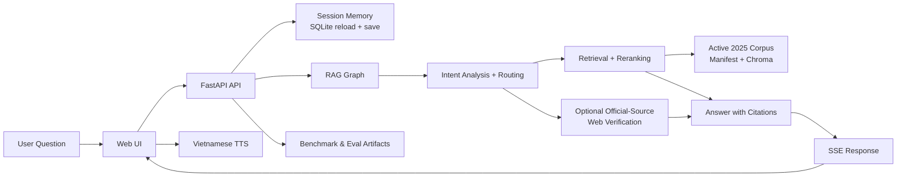

# VietLegal Traffic RAG Architecture

## Goal

Build a local demo that answers Vietnamese traffic-law questions credibly within a narrow scope:

- penalties
- core traffic rules
- expressway speed questions

The architecture favors explainability, conservative fallback behavior, short-term memory, and recruiter-friendly proof.

## Request Flow

1. The user sends a question to `/chat` or `/chat/stream`.
2. The API reloads recent turns from SQLite using `session_id`.
3. The graph runs `intent_analyzer`, `query_router`, `retriever`, `reranker`, optional `web_searcher`, and `generator`.
4. The app stores the assistant turn, exposes it again through history endpoints, and can stream the answer back over SSE.
5. The web UI can request Vietnamese TTS for local demo playback.
6. Benchmarks exercise the same retrieval and generation pipeline in different modes.

## Main Layers

### Web UI

- [`../src/api/static/index.html`](../src/api/static/index.html)
- Streams answers over SSE
- Restores prior sessions and chat history
- Plays Vietnamese TTS for local demos

### FastAPI API

- [`../src/api/main.py`](../src/api/main.py)
- [`../src/api/routes.py`](../src/api/routes.py)
- Serves the web app and chat endpoints
- Translates graph output into API payloads

### RAG Pipeline

- [`../src/agent/graph.py`](../src/agent/graph.py)
- [`../src/agent/nodes.py`](../src/agent/nodes.py)
- [`../src/agent/intent.py`](../src/agent/intent.py)
- [`../src/agent/retrieval.py`](../src/agent/retrieval.py)
- [`../src/agent/answers.py`](../src/agent/answers.py)
- [`../src/agent/text_utils.py`](../src/agent/text_utils.py)
- [`../src/agent/rule_based.py`](../src/agent/rule_based.py)
- [`../src/agent/chat_flow.py`](../src/agent/chat_flow.py)
- [`../src/agent/state.py`](../src/agent/state.py)
- `nodes.py` now acts as a compatibility facade, while the split modules hold intent parsing, retrieval, rule-based guardrails, and generation logic
- `chat_flow.py` keeps `/chat` and `/chat/stream` aligned so the API does not duplicate the pipeline manually
- `text_utils.py` and `rule_based.py` hold the lightweight heuristics and compact high-confidence answers used by the public benchmark

### Session Memory

- [`../src/memory/store.py`](../src/memory/store.py)
- Uses SQLite for short-term follow-up context
- Keeps the demo simple and easy to explain in interviews

### Corpus and Retrieval

- [`../src/ingest/loader.py`](../src/ingest/loader.py)
- [`../src/ingest/build_db.py`](../src/ingest/build_db.py)
- [`../data/manifest.json`](../data/manifest.json)
- Loads only the active 2025 corpus and rebuilds Chroma from the manifest

### Benchmark and Public Dataset

- [`../src/eval/run_benchmark.py`](../src/eval/run_benchmark.py)
- [`../datasets/vietlegal-traffic-eval-v2/README.md`](../datasets/vietlegal-traffic-eval-v2/README.md)
- [`../docs/benchmarks/latest_summary.md`](../docs/benchmarks/latest_summary.md)
- Produces recruiter-facing proof with the 300-case v2 package without changing runtime APIs

## Design Choices

- Narrow legal scope instead of broad but unreliable coverage
- Short-term session memory instead of complex user-profile memory
- Official-source web confirmation only when local evidence is weak or the user asks for it
- Manifest-driven active corpus selection so the legal basis stays explainable

## Interview Summary

> I built a scoped Vietnamese traffic-law RAG demo with session memory, split agent modules, official-source verification, and a reproducible 300-case benchmark package.
